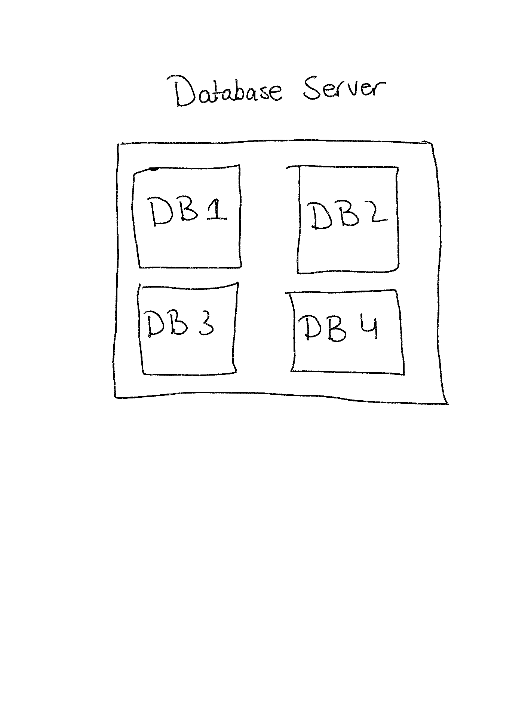

# Creating Databases and Tables
When you start `mysql service` it starts mysql database server and within that server you can have individual `databases` as show in a diagram.

## Creating Databases in `MYSQL`
- `show databases;` command displays all the databases in the mysql server.
- `CREATE DATABASE <name>` command allows you to create a database in the mysql server.

When creating a database make sure you are consisten with the names as you can't use spaces within the names when creating a database.

For Example, `CREATE DATABASE hello world;` -> this is not acceptable you can do something like `CREATE DATABASE hello_world;`

**Note: You don't have to use capitalized commands you can write commands in lowercase but it just signifies and its more like a convention.**

## Dropping Databases in `MYSQL`
You can use `DROP DATABASE <name_of_db>;` command to delete or drop a database.

**Note: If you don't use `;` it will not execute the command in `mysql`.**

## Using Databases in `MYSQL`